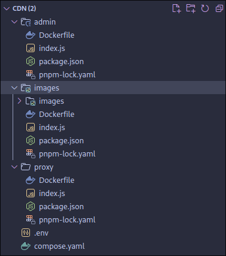
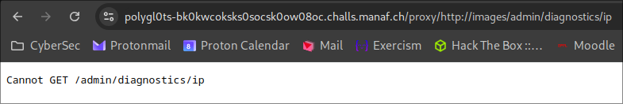
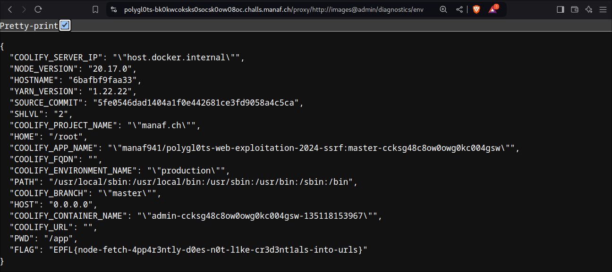

# CDN (Web)
Polygl0ts friday meeting 2, 04.10.2024
## Introduction
> Since we use multiple servers to handle our load, we installed a proxy between the internet and us. However, since we fear vulnerabilities in open source projects, we developed our own.
> https://polygl0ts-bk0kwcoksks0socsk0ow08oc.challs.manaf.ch

## Enumeration 

We are given the source code for a home-made proxy server.
It comes in the form of a docker compose with three containers: **admin**, **images** and **proxy**.



We see a `.env` file with the following content:
``` env
FLAG=flag{1234}
```
This is probably what we need to recover on the server !
We see it being added to an environment variable in the **compose.yaml** file:

``` yaml
services:
  images:
    build: ./images

  admin:
    build: ./admin
    environment:
      - FLAG=${FLAG}

  proxy:
    build: ./proxy
    ports:
      - 31337:3000
```

### admin
In this container (in **index.js**), we are given a bunch of endpoints meant at admins, giving access to a lot of information about the process and system, including:

``` js
...

app.get("/diagnostics/config", (req, res) => {
  res.status(200).send(process.config);
});

app.get("/diagnostics/env", (req, res) => {
  res.status(200).send(process.env);
});

app.get("/diagnostics/uptime/sys", (req, res) => {
  res.status(200).send({ system_uptime: os.uptime() });
});

...
```

>We notice that there is an endpoint for **process.env**, which is likely what we need to access to get the flag !

Also we see its name is admin so it is probably also the domain name used to access it via network requests. 

We are however unable to access it using the given endpoint.



**All of this hints strongly at a SSRF vulnerability, in which we get the proxy to make requests to the admin container on our behalf.**

But let's finish our enumeration before diving into that.

### images
Nothing very interesting in here, it is mostly a mockup service that we are allowed to access through the proxy.
The `/static` endpoint gives us a random image, and the `/list` gives us a the list of images we can access through `/static`.

### proxy
We have once again an Express app that acts as a proxy, but with some restrictions
``` js
app.use("/proxy/", async (req, res, next) => {
    // proxy to the requested url
    try{
        const url = new URL(
            req.url.slice(1)
        )
        
        // verify the url origin
        const urlstr = url.toString()
        if(!urlstr.startsWith("http://images"))throw new Error("Unsupported url origin")
        
        // remove the website from the url so the proxy can work through that
        req.url = req.url.slice(-url.pathname.length)

        proxy(url.hostname)(req, res, next)
    }catch(err){
        next(err)
    }
})
```

The `url` variable is constructed by taking the url from the request and removing the leading `/`. So for example if the request was made to `http://localhost:3000/proxy/http://images`, it will be `http://images`.

An error will be thrown if `url` doesn't start with `http://images`. Once that check is passed, the new url is extracted as everything that comes after the domain, and the call is made.

This is the part we need to exploit to make the request to `admin` instead of `images`.

## Exploitation

What we ultimately want is `url.hostname = "admin"` and `url.pathname = "/diagnostics/env"`.

For this we need a way to "comment out" the beginning of the url, and after a bit of research I found [the Hacktricks page about URL Format Bypass](https://book.hacktricks.xyz/pentesting-web/ssrf-server-side-request-forgery/url-format-bypass) which proposes the following trick to achieve domain confusion:

```
https://{domain}@attacker.com
```

The idea is simply that everything before the `@` will be parsed as a "username" and thus ignored, and the domain we will connect to is what comes after. We can use this for our exploit !

> **Note** This was a feature in the old days of HTTP allowing to authenticate a user directly in the url, **but this is very discouraged nowadays since this is sent in plaintext**.

Here is the final payload (to be appended to the chall url):

```
/proxy/http://images@admin/diagnostics/env
```

Which gives us the flag ! 



**Flag:** `EPFL{node-fetch-4pp4r3ntly-d0es-n0t-l1ke-cr3d3nt1als-into-urls}`

> **Tip** As always it is very useful to reproduce an environment that is as close as the target host to develop our exploit. In that case we can run the `index.js` of `proxy` with `node` and add some `console.log` calls to check that everything works as expected ;)
